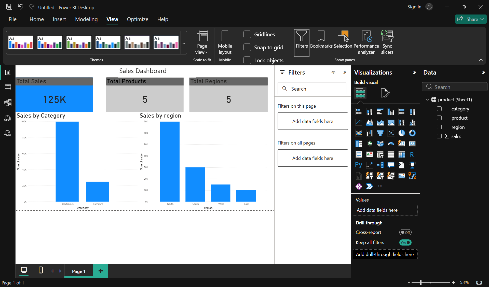

Sales Dashboard (Power BI)

## Overview

This project is a Power BI dashboard created to analyze sales performance across categories and regions.

##  Features

* KPI Cards (Total Sales, Total Products, Total Regions)
* Sales by Category visualization
* Sales by Region visualization
* Interactive slicer for filtering

##  Tools Used

* Power BI
* Excel (Data Source)

##  Dashboard Preview

##  Insights

* Electronics category has highest sales
* North region contributes most revenue
